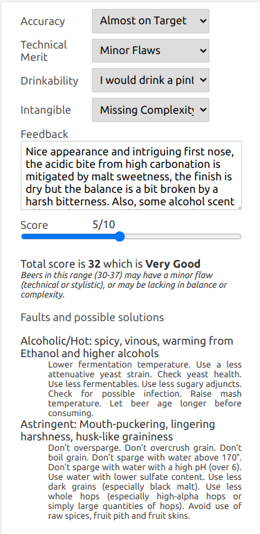
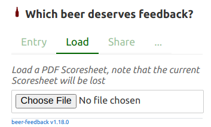

#  Beer Feedback

## About

Homebrewers deserve a real and helpful feedback better than "Yeah, I like this. Not bad at all".

`beer-feedback` guides you through a beer evaluation based on the [BJCP Scoresheet](https://dev.bjcp.org/news/structured-scoresheets-for-aha-nhc/),
and produces a readable and detailed PDF document.

It should be straightforward to use for a [BJCP](https://dev.bjcp.org/) judge,
but it can be used by any beer lovers to improve judging abilities, wherever there is beer and a smartphone!

## Try it

There is nothing to install, no account to create, 
just use your smartphone, tablet, or your computer to open:

https://beer-feedback.surge.sh/


How to use it?
1. Fill out all the forms until there is no more red tabs
2. Click on the `PDF` button to generate the Scoresheet
3. Share the PDF the way you want
 
Read the next section for more details.

Don't forget to [star the project on GitHub](https://github.com/bdelbosc/beer-feedback) if you like it. 

## Usage

### Preparation

The first time, you have to give your name and fill your judging rank if any, 
you can add additional information to be contacted if you want,
this information is persisted in your browser and will be part of the final PDF report.

 

Click on `>> Beer` and describe the beer entry that you want to evaluate, you need to provide the BCJP category and an entry identifier,
this information will be persisted on your browser. 

When you're ready, pour your beer and click on `>> Go to the Scoresheet`


### Filling the Scoresheet

There is a tab for each Scoresheet section (**A**roma, **A**ppearance, **F**lavor, **M**outhfeel and **O**verall impression).


Follow the directive in red to complete this tab: `Comments on malt, hops, fermentation and score`

Use the `Add aromatic` button to add the required malt, hops and fermentation aromas,
the aroma wheel is here to help:
   


Navigate in the aroma wheel, click on the center to go back, validate the aroma using the check button.
Then describe the aroma properties and intensity using the slider:


Validate again, the aroma is added to the list.
  
Continue with all the aromatics that you can detect:


Add some comments if you want and set a score for the aroma using the slider, the `Aroma` tab is now in green because it is completed:


  
Note that you can click on any aroma to edit the intensity or its properties, they can also be deleted using the (x) button on the right.
    
Now click on the next tab `A` for `Appearance`, select a color and other options, add a comment if you want and set a score:


On the bottom of each tab you can display the specific BJCP Guideline to help you:


 
Continue to fill all the sections, on the bottom of `Overall` tab, you will find 2 helpers:
- The meaning of the current score, that must match your feedback and appreciation
- A list of possible solutions for the flaws that have been entered using Aroma or Flavor wheels:


    
When you are done, click on the `PDF` button:


The report is generated on your browser and available in your Download directory,

You should have something similar to this:
    
[](./scoresheet-20210109-1-12B-John_Doe.pdf)

Note that even if the PDF button is grayed until the Scoresheet is completed it is
possible to generate a PDF at anytime.

The PDF file name follow the pattern: `scoresheet-<date>-<entry>-<category>-<judge name>.pdf` for instance `scoresheet-20210109-1-12B-John_Doe.pdf`.

### Load an existing Scoresheet

A beer-feedback PDF Scoresheet can be loaded (from the beer entry section), this enables to edit the content and produce a new PDF.



### Share links for a beer entry 

When you have filled a beer entry description, you can share a link with other judges from the `Share` tab:


Copy then send a message like:

  Please evaluate the following beer and send me your Scoresheet before next monday:  
  https://beer-feedback.surge.sh/?beerEntry=20w34b1&beerCategory=24C&beerSpecial=Seeds%20of%20paradise&beerComment=Name%20of%20the%20beer%2C%20purchased%20from%20...%204.40%E2%82%AC%2075cl
       
Following the link will auto fill the beer entry, and your Scoresheet is ready to be started.

You can also print a QR code with the share link and stick it to your bottle. 

### Export the report as text

This can be useful if you want to integrate the feedback inside other tools like Beersmith or Brewfather tasting notes. 


### Compare multiple Scoresheets

Now you have received multiple feedbacks for your beer, there is an experimental tool to compare them:
Use [Beer Feedback Comparator](https://github.com/bdelbosc/beer-feedback-comparator#try-it).

## FAQ

### Some aromatic is missing in the aroma wheel?

First select the correct category from the wheel, 
the wheel selection is an editable field, so you can type whatever you want.


If you think some aroma or flavor should be added by default, or some are wrongly classified, 
please create an issue:

https://github.com/bdelbosc/beer-feedback/issues

### I don't want to type a long text on my smartphone!

Some possible work around:

- Use a tablet or a laptop

- Enter your text using voice transcription

- Use a slim portable keyboard

- Use your smartphone to fill the scoresheet except the comments, 
  continue editing the scoresheet on a computer:
    - Create a PDF from your smartphone
    - Transfer the PDF by mail (or whatever) to your computer
    - Open [BF](https://beer-feedback.surge.sh/), read the PDF from the `Load` tab and continue editing

- Create a PDF, print it and finish with a pen!

### My fingers are too awkward, or the app is clunky?

Please fill an issue to improve the usability:

https://github.com/bdelbosc/beer-feedback/issues

###  What does the following term mean?

The terms used in the application try to follow the [Beer Judge Certification Program](https://bjcp.org/) terminology.

If you think they are inappropriate or can be improved, please report an issue:

https://github.com/bdelbosc/beer-feedback/issues

### I am X times faster using a paper Scoresheet

For sure if you are an experimented BJCP judge you have spent such an amount of time to master this,
why should you expect to be more efficient on a new application under development without experimenting a bit. 

Also, you should take into account the time to scan your paper, and the time others are spending trying to interpret it.

And if you want to compare the perceived aromas on more than 3 paper Scoresheets, it becomes a rabbit hole.

### I lost my Scoresheet!

You can only edit a single Scoresheet at a time.

The current Scoresheet can be lost in the following cases:
- you load a new PDF Scoresheet
- you are opening a "Shared Link" to start a new beer entry
- you are closing `beer-feedback` that is running in a private session

In these cases, you should have a popup that warns you, if you don't want to lose the current Scoresheet,
simply create a PDF of the current Scoresheet.

### Hey, it worked!

Cool, because it is a static page without analytic to track you and because you can generate tons of Scoresheets without generating any traffic on the site,
I have no idea if the application works for you unless you star the project on Github, cheers!.
   
### I want a JSON Scoresheet not a PDF

The PDF Scoresheet contains a JSON representation in its metadata, here is a way to reveal it:

```bash
grep Keyword scoresheet-20200816-2-10A-Raoul.pdf | sed -e 's,.*(,,g' -e 's,.$,,g' | python -c "import sys; from urllib.parse import unquote ; print(unquote(sys.stdin.read()))"  | jq .
{
  "user": {
    "completed": true,
    "updated": false,
    "required": [],
    "name": "Raoul",
    "rank": "bjcp-pending"
  },
  "beer": {
    "completed": true,
    "updated": false,
    "required": [],
    "entry": "2",
    "category": "10A",
    "special": null,
    "comment": "Tap 7 Clone"
  },
  "aroma": {
    "completed": true,
    "updated": false,
    "required": [],
    "aromas": [
      {
        "level": 2,
        "category": "malt",
        "trait": "Bready/Bread Crust",
        "initial": false,
        "warms": true,
        "inappropriate": false
      },
      {
        "level": 3,
        "category": "hops",
        "trait": "Not Found ",
        "initial": false,
        "warms": false,
        "inappropriate": false
      },
...
```

## Design choices

- Works on old smartphone or any computer with a recent browser
- Works with bad internet connection
- 0 installation
- 0 cloud

Technical choices:
- Single Page Application or [SPA](https://en.wikipedia.org/wiki/Single-page_application)
- [Svelte](https://svelte.dev/) UI
- Use [Plotly Sunburst](https://plot.ly/javascript/sunburst-charts/) to pickup aromas and flavors

## Disclaimer 

This application is a personal project and should not be used in official competition.  

This application uses [Beer Judge Certification Program](https://bjcp.org/) terms and derivative output of the 2021 BJCP Style Guide.
This is only for personal educational purpose.

The BJCP data or any derivative output are protected by the BJCP Copyright and should not be marketed for profit
or integrated or embedded in websites without the BJCP agreement.

The most current version of the BCJP Style Guide can be found on the [BJCP web site](https://www.bjcp.org/).

