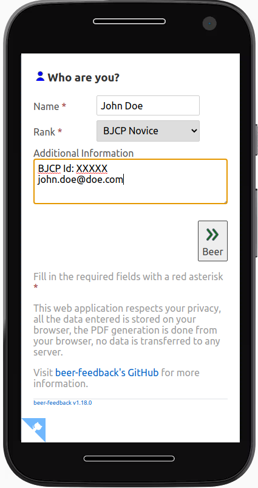
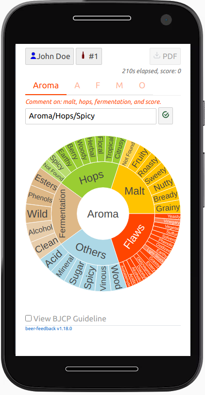

#  Beer Feedback

## About

`beer-feedback` is intended to provide a quick and detailed assessment of the beer that home brewers deserve.

It can also be used to improve your judging ability wherever there is a beer and a smartphone.

The evaluation is based on the [BJCP Scoresheet](https://dev.bjcp.org/news/structured-scoresheets-for-aha-nhc/) and should be familiar to [BJCP](https://dev.bjcp.org/) Judges.

The result is a PDF document that can be shared like any document.

## Try it

There is nothing to install and no account to create, 
just use your smartphone (or any browser) to reach this URL:

http://beer-feedback.surge.sh/

Fill out all the forms until there is no more red tab titles, then click the PDF button, read the next section for more details.

Don't forget to [star the project on GitHub](https://github.com/bdelbosc/beer-feedback) if you like it. 

## Usage

1. The first time, you have to give your name and fill your judging rank if any, this information is persisted in your smartphone and will be part of the final PDF report.

     

2. Describe the beer that you want to evaluate, this information will be persisted on your smartphone. 

    

3. Start to fill your scoresheet, there is a tab for each section (Aroma, Appearance, Flavor, Mouthfeel and Overall impression).

    

    Use the (+) button to add aromatic
   
    

    Navigate in the aroma wheel and validate the entry using the check button.
    Then describe the intensity and other aroma properties:

    

    Validate again, the aroma is added to the list.
  
    You need to add at least one aroma for malt, hops and fermentation,
    then you set the aroma score using the slider, and the section is now completed:
  
    
    
    Note that you can click on any aroma to edit the intensity or properties, they can also be deleted using the (x) button on the right.
    
    Now continue with other tabs: Appearance, Flavor, Mouthfeel and Overall.
    
4. Click on PDF, the report is generated on your smartphone there is no data transferred anywhere.
   Here is a PDF example:
    
   

   It is also possible to generate the report when the scoresheet is not yet completed.
  
5. Share the PDF the way you want, if you have a PDF editor you can add a photo of the beer.        

A beer-feedback PDF scoresheet can be loaded (from the beer entry section), this enables to edit the content and produce a new PDF.

## FAQ

### Some aromatic is missing in the aroma wheel?

First select the correct category from the wheel, 
the wheel selection is an editable field, so you can type whatever you want.

If you think some aroma or flavor are missing or wrongly classified, 
please create an issue:  

https://github.com/bdelbosc/beer-feedback/issues

### I can't enter a long text from my smartphone!

Possible work around:

- Enter your text using voice transcription

- Continue the Scoresheet on a computer using a keyboard:
    - Create a PDF from your smartphone
    - Transfer the PDF by mail (or whatever) to your computer
    - Open [BF](http://beer-feedback.surge.sh/), read the PDF from the "Load" tab and continue editing

- Create a PDF, print it and finish with a pencil

### My fingers are too awkward, or the app is clunky?

Help to improve the usability, fill an issue:

https://github.com/bdelbosc/beer-feedback/issues

###  What does the following term mean?

The terms used in the application try to follow the [Beer Judge Certification Program](https://bjcp.org/) terminology.

If you think they are inappropriate or can be improved, please report an issue:

https://github.com/bdelbosc/beer-feedback/issues

### I lost my Scoresheet!

For now, the information you enter in the scoresheet (except the user name, user rank, and beer entry) are not
persisted, if you close the browser they are lost.

Fortunately, if you leave the site there should be a popup to warn you in such case.

Before leaving or at any time just create a PDF, you will be able to load it from the beer section and continue editing.

Do this if you have to restart your phone, your battery is low, or if you want to terminate the Scoresheet later.

### The connection to the site is Not Secure (no https)!

This is a static site, all the information you entered remains on your browser, 
this browser security alert is not relevant for this site.

### Hey, it worked!

Cool, because it is a static page without analytic to track you and because you can generate tons of Scoresheets without generating any traffic on the site,
I have no idea if the applicaiton works for you unless you star the project on Github, cheers!.
   
## Design choices

- 0 installation
- 0 cloud
- Work on any smartphone or computer with a recent browser

Technical choices:
- Single Page Application or [SPA](https://en.wikipedia.org/wiki/Single-page_application)
- [Svelte](https://svelte.dev/) UI
- Use [Plotly Sunburst](https://plot.ly/javascript/sunburst-charts/) to pickup aromas and flavors

## Disclaimer 

This application is a personal project and should not be used in official competition.  

This application uses [Beer Judge Certification Program](https://bjcp.org/) terms and derivative output of the 2015 BJCP Style Guide.
This is only for personal educational purpose.

The BJCP data or any derivative output are protected by the BJCP Copyright and should not be marketed for profit
or integrated or embedded in websites without the BJCP agreement.

The most current version of the BCJP Style Guide can be found on the [BJCP web site](https://www.bjcp.org/).

 

