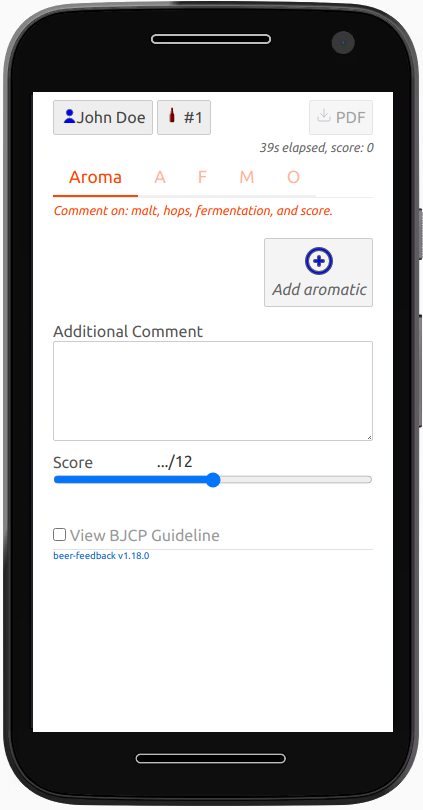
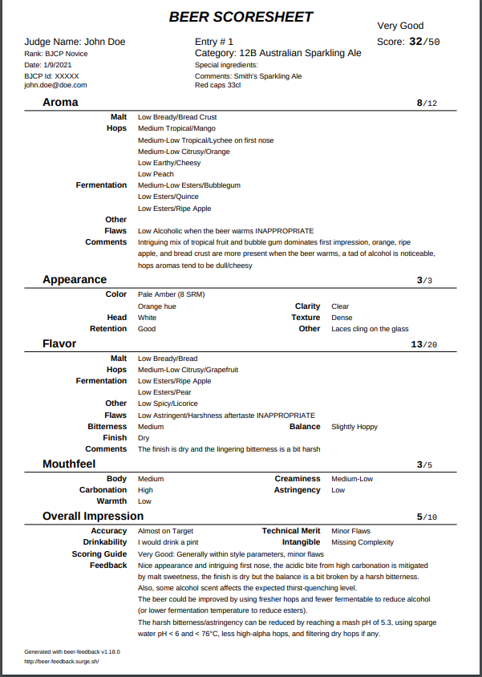

# beer-feedback

## About

`beer-feedback` is intended to provide a quick and detailed assessment of the beer that homebrewers deserve.

It can be used wherever there is a beer and a smartphone
(Internet is required for the first time to download the app as well as to share your review).

The evaluation is based on the [BJCP Scoresheet](https://dev.bjcp.org/news/structured-scoresheets-for-aha-nhc/) and should be familiar to [BJCP](https://dev.bjcp.org/) Judges.

The result is a PDF document that can be saved and shared like any PDF document.

## Try it

There is nothing to setup, use your smartphone or any browser:

http://beer-feedback.surge.sh/

Fill out all the forms until there is no more red tab titles, then click the PDF button.

## Usage

1. The first time, you have to give your name and judging rank, this information is persisted in your smartphone and will be part of the final PDF report.

     

2. Describe the beer that you want to evaluate, this information is also persisted on your smartphone. 

    

3. Start to fill your scoresheet, there is a tab for each section (Aroma, Appearance, Flavor, Mouthfeel and Overall impression).

    

    Use the (+) button to add aromatic using an aroma wheel
   
    

    Then validate using the check button and give the intensity or other property of the aroma:

    

    Validate again, the aroma is added to the list.
  
    Once you a have added an aroma for each category (malt, hops and fermentation) and put a score
    the aroma form is completed and the tab title is now green:
  
    
    
    Note that you can click on any aroma to change the intensity or add other property later.
    
    Continue with Appearance, Flavor, Mouthfeel and Overall tabs
    
4. Click on PDF, the report is generated on your smartphone there is no data transferred on the server side.
   It is also possible to generate the report if the scoresheet is not yet completed.
   
   Here is a PDF example:
    
   
  
5. Share the PDF the way you want, if you have a PDF editor you can add a photo of the beer.        

A beer-feedback PDF scoresheet can be loaded (from the beer entry section), this enables to edit the content and produce a new PDF.
   
## Design choices

- 0 installation
- 0 cloud
- Work on any smartphone or computer with a recent browser

Technical choices:
- Single Page Application or [SPA](https://en.wikipedia.org/wiki/Single-page_application)
- [Svelte](https://svelte.dev/) UI
- Use [Plotly Sunburst](https://plot.ly/javascript/sunburst-charts/) to pickup aromas and flavors

## Disclaimer 

This application is a personal project and should not be used in official competition.  

This application uses [Beer Judge Certification Program](https://bjcp.org/) terms and derivative output of the 2015 BJCP Style Guide.
This is only for personal educational purpose.

The BJCP data or any derivative output are protected by the BJCP Copyright and should not be marketed for profit
or integrated or embedded in websites without the BJCP agreement.

The most current version of the BCJP Style Guide can be found on the [BJCP web site](https://www.bjcp.org/).

 

