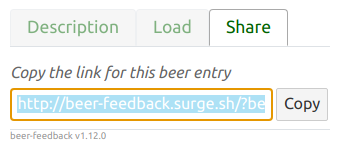

#  Beer Feedback

## About

`beer-feedback` is intended to provide a quick and detailed assessment of the beer that home brewers deserve.

It can also be used to improve your judging ability wherever there is a beer and a smartphone.

The evaluation is based on the [BJCP Scoresheet](https://dev.bjcp.org/news/structured-scoresheets-for-aha-nhc/) and should be familiar to [BJCP](https://dev.bjcp.org/) judges.

The result is a PDF document that can be shared like any document.

## Try it

There is nothing to install and no account to create, 
just use your smartphone (or any browser) to reach this URL:

http://beer-feedback.surge.sh/


Fill out all the forms until there is no more red tab titles, then click the PDF button, read the next section for more details.

Don't forget to [star the project on GitHub](https://github.com/bdelbosc/beer-feedback) if you like it. 

## Usage

### Preparation

The first time, you have to give your name and fill your judging rank if any, this information is persisted in your smartphone and will be part of the final PDF report.

 

Then describe the beer that you want to evaluate, you need to provide the BCJP category and an entry identifier,
this information will be persisted on your smartphone. 
When you're ready, pour your beer and go to the Scoresheet


### Filling the Scoresheet

There is a tab for each Scoresheet section (**A**roma, **A**ppearance, **F**lavor, **M**outhfeel and **O**verall impression).


Follow the directive in red to complete this tab: "Comments on malt, hops, fermentation and score"

You have to add aromatic for malt, hops and fermentation using the aroma wheel:
   


Navigate in the aroma wheel and validate the entry using the check button.
Then describe the intensity and other aroma properties:


Validate again, the aroma is added to the list.
  
Once you have added all the required aromatics set a score using the slider, the `Aroma` tab is now completed:
  

  
Note that you can click on any aroma to edit the intensity or its properties, they can also be deleted using the (x) button on the right.
    
Continue with the `Appearance` tab:


Note that on the bottom of each tab you can display the specific BJCP Guideline:


 
On the bottom of `Overall` tab, you will find 2 helpers:
- The meaning of the current score, that must match your feedback and appreciation
- A list of possible solutions for the flaws that have been entered using Aroma or Flavor wheels


    
Click on the `PDF` button, the report is generated on your smartphone and available in your Download directory,

You should have something similar to this:
    
[](./scoresheet-20200816-2-10A-Raoul.pdf)

Note that you can generate a PDF Scoresheet at anytime even when the scoresheet is incomplete.

The PDF file name follow the pattern: `scoresheet-<date>-<entry>-<category>-<judge name>.pdf`

### Load an existing Scoresheet

A beer-feedback PDF Scoresheet can be loaded (from the beer entry section), this enables to edit the content and produce a new PDF.

### Share links for a beer entry 

When you have filled a beer description, you can share a link with other judges from the `Share` tab:



Copy then send a message like:

  Please evaluate the following beer and send me your Scoresheet before next monday:  
  http://beer-feedback.surge.sh/?beerEntry=20w34b1&beerCategory=24C&beerSpecial=Seeds%20of%20paradise&beerComment=Name%20of%20the%20beer%2C%20purchased%20from%20...%204.40%E2%82%AC%2075cl
       
Following the link will auto fill the beer entry, and your Scoresheet is ready to be started.

## FAQ

### Some aromatic is missing in the aroma wheel?

First select the correct category from the wheel, 
the wheel selection is an editable field, so you can type whatever you want.

If you think some aroma or flavor should be added by default or some are wrongly classified, 
please create an issue:

https://github.com/bdelbosc/beer-feedback/issues

### I don't want to type a long text on my smartphone!

Possible work around:

- Enter your text using voice transcription

- Continue the Scoresheet on a computer using a keyboard:
    - Create a PDF from your smartphone
    - Transfer the PDF by mail (or whatever) to your computer
    - Open [BF](http://beer-feedback.surge.sh/), read the PDF from the `Load` tab and continue editing

- Create a PDF, print it and finish with a pen

### My fingers are too awkward, or the app is clunky?

Please fill an issue to improve the usability:

https://github.com/bdelbosc/beer-feedback/issues

###  What does the following term mean?

The terms used in the application try to follow the [Beer Judge Certification Program](https://bjcp.org/) terminology.

If you think they are inappropriate or can be improved, please report an issue:

https://github.com/bdelbosc/beer-feedback/issues

### I lost my Scoresheet!

For now, the information you enter in the scoresheet (except the user name, user rank, and beer entry) are not
persisted, if you close the browser they are lost.

Fortunately, if you leave the site there should be a popup to warn you in such case.

Before leaving or at any time just create a PDF, you will be able to load it from the beer section and continue editing.

Do this if you have to restart your phone, your battery is low, or if you want to terminate the Scoresheet later.

### I am X times faster using a paper Scoresheet

For sure if you are an experimented BJCP judge you have spent such an amount of time to master this,
why should you expect to be more efficient on a new application under development without experimenting a bit. 

Also, you should take into account the time to scan your paper and the time others are spending trying to interpret it.

If you want to compare the perceived aromas on more than 3 paper Scoresheets it becomes a rabbit hole.

### The connection to the site is Not Secure (no https)!

This is a static site, all the information you entered remains on your browser, 
this browser security alert is not relevant for this site.
 
### Hey, it worked!

Cool, because it is a static page without analytic to track you and because you can generate tons of Scoresheets without generating any traffic on the site,
I have no idea if the applicaiton works for you unless you star the project on Github, cheers!.
   
### I want a JSON Scoresheet not a PDF

The PDF Scoresheet contains a JSON representation in its metadata, here is a way to reveal it:

```bash
grep Keyword scoresheet-20200816-2-10A-Raoul.pdf | sed -e 's,.*(,,g' -e 's,.$,,g' | python -c "import sys; from urllib.parse import unquote ; print(unquote(sys.stdin.read()))"  | jq .
{
  "user": {
    "completed": true,
    "updated": false,
    "required": [],
    "name": "Raoul",
    "rank": "bjcp-pending"
  },
  "beer": {
    "completed": true,
    "updated": false,
    "required": [],
    "entry": "2",
    "category": "10A",
    "special": null,
    "comment": "Tap 7 Clone"
  },
  "aroma": {
    "completed": true,
    "updated": false,
    "required": [],
    "aromas": [
      {
        "level": 2,
        "category": "malt",
        "trait": "Bready/Bread Crust",
        "initial": false,
        "warms": true,
        "inappropriate": false
      },
      {
        "level": 3,
        "category": "hops",
        "trait": "Not Found ",
        "initial": false,
        "warms": false,
        "inappropriate": false
      },
...
```

## Design choices

- Works on old smartphone or any computer with a recent browser
- Works with bad internet connection
- 0 installation
- 0 cloud

Technical choices:
- Single Page Application or [SPA](https://en.wikipedia.org/wiki/Single-page_application)
- [Svelte](https://svelte.dev/) UI
- Use [Plotly Sunburst](https://plot.ly/javascript/sunburst-charts/) to pickup aromas and flavors

## Disclaimer 

This application is a personal project and should not be used in official competition.  

This application uses [Beer Judge Certification Program](https://bjcp.org/) terms and derivative output of the 2015 BJCP Style Guide.
This is only for personal educational purpose.

The BJCP data or any derivative output are protected by the BJCP Copyright and should not be marketed for profit
or integrated or embedded in websites without the BJCP agreement.

The most current version of the BCJP Style Guide can be found on the [BJCP web site](https://www.bjcp.org/).

